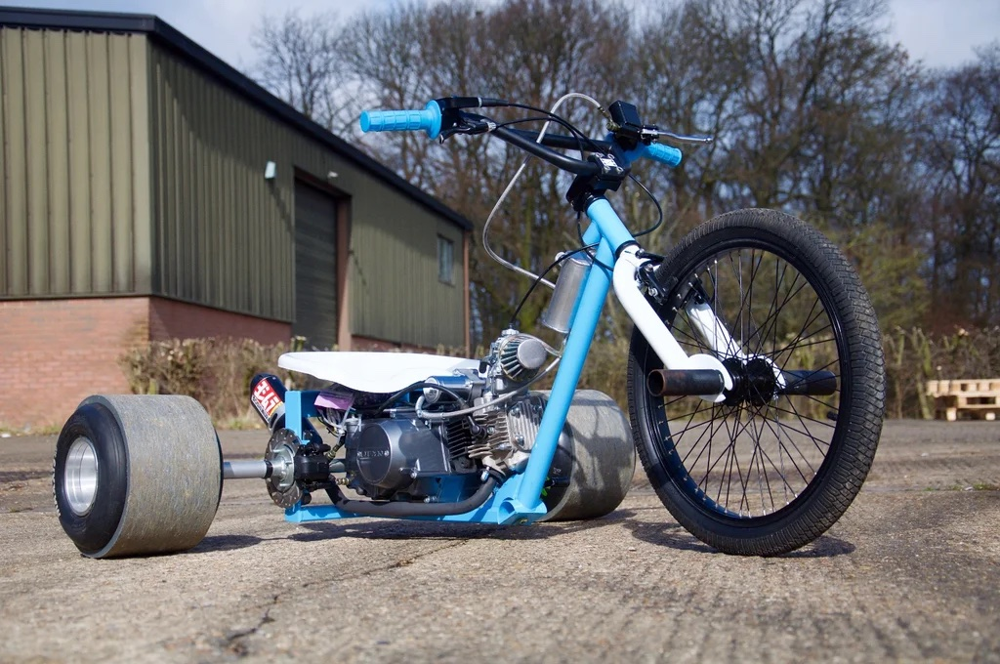

### Предложение
Построить к весне дрифт-трайк.

Почему нужна команда? Вместе веселее строить, вместе веселее кататься, бюджет постройки становится намного приятнее.  
Это классное и уникальное развлечение.

### План

#### 1. Подготовка
0. Вдохновиться.
1. Сбор команды.
2. Изучение конструкции.
3. Решить как строим: на ДВС или электро.
4. Выяснить не нарушим ли мы каких законов и где на нем можно кататься.
5. Составить простенький договор о партнерском проекте (как скидываемся, как строим, как потом владеем, как храним и как катаемся).

#### 2. Стягивание ресурсов
1. Сбор бюджета.
2. Закупка материалов, узлов и инструмента.
3. Закладка места постройки.

#### 3. Постройка
1. Строим.
2. Пьем.
3. Курим.
4. Строим.

#### 4. Апофеоз
1. Катаемся.
2. Наслаждаемся
3. Думаем куда его деть

### Детали
Бюджет с материалами и инструментами я оцениваю в 2000 ойро.  
Кататься очевидно можно одному человеку за раз, но мне кажется норм вариант кататься сессиями по 10 минут и ротироваться.  
Катать можно дороги, велодорожки или большие пятяки-парковки.  
Все вопросы можно задать в телегу @page_up  
